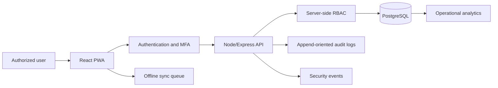

# Architecture

HPIS is designed as a defense-in-depth humanitarian information-management platform.

The current implementation is a local React prototype with synthetic data. The intended production version separates UI, API, database, authentication, audit, encryption and offline synchronization.

## Principles

- Use synthetic data for all demos.
- Minimize identifying data collection.
- Enforce RBAC server-side in production.
- Record meaningful audit events without storing unnecessary sensitive metadata.
- Keep AI assistive only, with human review required.
- Support field workflows where connectivity can be intermittent.
